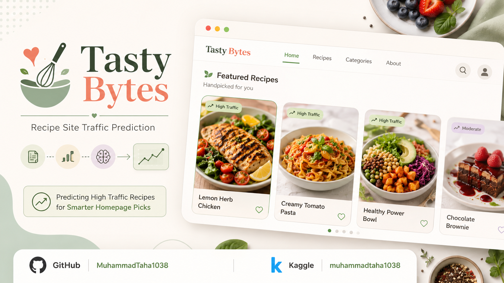

# Tasty Bytes: Recipe Site Traffic Prediction

A precision-first machine learning project that predicts whether a recipe is likely to generate high traffic on the Tasty Bytes recipe platform. The project combines data quality work, exploratory analysis, model comparison, and business-driven threshold optimization to support better homepage recipe selection.

> **Project status:** Exploratory modeling complete. The repository currently contains the analysis notebook and source dataset; it does not yet include a production prediction API or dashboard.

## Overview

Tasty Bytes currently selects homepage recipes using product intuition. That approach is difficult to scale and may waste limited homepage space on recipes that do not attract strong traffic. This project turns the selection process into a binary classification problem:

- **Positive class:** Recipe generates high traffic
- **Negative class:** Recipe does not generate high traffic
- **Primary business metric:** Precision among recipes recommended for homepage placement
- **Standard business target:** At least 80% precision
- **Strict planning target:** At least 95% precision when homepage inventory is limited

Precision is prioritized over accuracy because a false positive means recommending a recipe that is unlikely to deliver the desired traffic outcome. In this business context, fewer high-confidence recommendations are preferable to a larger list containing weaker selections.

## Results At A Glance

| Measurement | Result |
|---|---:|
| Raw records | 947 |
| Input columns | 8 |
| High-traffic recipes | 60.6% |
| Train/test split | 80% / 20% |
| Test set | 190 recipes |
| Logistic regression CV precision | 81.90% |
| Random forest CV precision | 81.36% |
| Logistic regression precision at threshold 0.50 | 89.00% |
| Optimized threshold | 0.66 |
| Precision at optimized threshold | **95.92%** |
| Recall at optimized threshold | 40.87% |
| Accuracy at optimized threshold | 63.16% |

The default logistic regression model already exceeds the 80% precision requirement. Raising its probability threshold to 0.66 produces a stricter recommendation policy that exceeds 95% precision, at the cost of lower recall.

## Business Findings

### Category is the strongest practical signal

The exploratory analysis found that recipe category is substantially more informative for traffic prediction than the nutritional variables. The category-level traffic rates provide immediate guidance even before model deployment:

- **Vegetable, Potato, and Pork:** More than 90% high-traffic rates in the notebook analysis; strong candidates for homepage promotion.
- **Meat and One Dish Meal:** More than 70% high-traffic rates; useful secondary candidates.
- **Lunch/Snacks and Dessert:** More than 60% high-traffic rates; reasonable candidates depending on available space.
- **Chicken and Breakfast:** Below 50% high-traffic rates; use more selectively.
- **Beverages:** Below 10% high-traffic rate; should be deprioritized for homepage placement.

### Nutrition alone is not enough

Calories, carbohydrate, sugar, and protein show near-zero correlation with the target in the notebook analysis. These variables remain useful as model inputs, but category and other behavioral or editorial signals are likely to provide more decision value.

### Recommendation policy matters

The same trained logistic regression model can support different operating policies:

| Policy | Precision | Recall | Interpretation |
|---|---:|---:|---|
| Random baseline | Approximately 60.6% | N/A | Mirrors the dataset's positive-class rate |
| Model, threshold 0.50 | 89.00% | 66.09% | Meets the normal homepage requirement |
| Model, threshold 0.66 | **95.92%** | 40.87% | Conservative policy for scarce homepage slots |

The threshold should be selected according to homepage capacity and the relative cost of false positives versus false negatives. The 95.92% result is a holdout-test result from this notebook, not a guarantee of future production performance.

## Dataset

The source file is [`data/recipe_site_traffic_2212.csv`](data/recipe_site_traffic_2212.csv). It contains 947 recipe records and these original columns:

| Column | Description | Original handling |
|---|---|---|
| `recipe` | Recipe identifier | Excluded from model features |
| `calories` | Calories per recipe | IQR cap, then median imputation |
| `carbohydrate` | Carbohydrate value | IQR cap, then median imputation |
| `sugar` | Sugar value | IQR cap, then median imputation |
| `protein` | Protein value | IQR cap, then median imputation |
| `category` | Recipe category | `Chicken Breast` merged into `Chicken`, then one-hot encoded |
| `servings` | Number of servings | Numeric portion extracted from values such as `4 as a snack` |
| `high_traffic` | Traffic outcome | `High` mapped to 1; missing values interpreted as 0 |

### Data quality treatment

1. The target was converted to a binary integer label.
2. Numeric serving values were extracted from mixed text values.
3. The erroneous `Chicken Breast` category was consolidated into `Chicken`, leaving 10 categories.
4. Nutritional outliers were capped at the upper IQR whisker, $Q3 + 1.5 \times IQR$.
5. Missing nutritional values were filled with column medians after capping.
6. The final modeling table contains zero missing values.

## Methodology

### Exploratory analysis

The notebook investigates:

- Missing values and data types
- Class distribution
- Category volume and category traffic rates
- Serving-size distribution
- Nutritional feature distributions after cleaning
- Correlations between nutritional values and traffic

### Feature preparation

- Dropped `recipe` because it is an identifier rather than a predictive business feature.
- Used one-hot encoding for `category` with `drop_first=True`.
- Treated `servings` as an ordinal/categorical-style count because it contains only six integer values from 1 through 6.
- Used `StandardScaler` for numeric features.
- Fit the scaler only on the training data to avoid test-set leakage.
- Used an 80/20 stratified train/test split with `random_state=42`.

### Models

Two classifiers were compared:

1. **Logistic Regression:** Interpretable baseline with probability outputs, making it suitable for threshold optimization.
2. **Random Forest:** Non-linear ensemble model that can capture interactions between features.

Both models used `class_weight='balanced'`. Hyperparameters were selected with five-fold `GridSearchCV`, scoring on precision:

- Logistic regression: `C = 1`
- Random forest: `n_estimators = 200`, `max_depth = 5`

### Threshold optimization

The logistic regression probability outputs were evaluated with a precision-recall curve. The lowest threshold meeting the strict 95% precision target was selected. On the saved test split, this threshold was 0.66.

## Repository Structure

```text
.
├── README.md
├── notebook.ipynb
├── Presentation.pptx
├── assets/
│   └── thumbnail.png       # Add the project thumbnail here
└── data/
    └── recipe_site_traffic_2212.csv
```

The README references `assets/thumbnail.png` as requested. Add the image file at that path before publishing if it is not already present.

## Getting Started

### Prerequisites

- Python 3.10 or newer recommended
- Jupyter Notebook or JupyterLab
- A Python environment with the packages listed below

### Installation

Create and activate a virtual environment, then install the project dependencies:

```bash
python -m venv .venv
```

Windows PowerShell:

```powershell
.venv\Scripts\Activate.ps1
python -m pip install --upgrade pip
pip install jupyter pandas numpy matplotlib seaborn scikit-learn
```

macOS/Linux:

```bash
source .venv/bin/activate
python -m pip install --upgrade pip
pip install jupyter pandas numpy matplotlib seaborn scikit-learn
```

### Run the notebook

From the project root, launch Jupyter:

```bash
jupyter notebook
```

Open `notebook.ipynb` and run the cells from top to bottom. The notebook expects the dataset at the relative path `data/recipe_site_traffic_2212.csv`.

## Reproducibility Notes

- The train/test split uses `random_state=42` and `stratify=y`.
- Both model families use `random_state=42`.
- Grid search uses five-fold cross-validation and precision scoring.
- Results may vary slightly across Python, pandas, NumPy, and scikit-learn versions.
- The notebook is an analysis artifact; it does not serialize a trained model or expose a prediction function.

## Limitations And Risks

- The dataset is relatively small, so the holdout metrics may be sensitive to the particular split.
- The target definition treats missing `high_traffic` values as non-high traffic; this assumption should be verified with the data owner.
- The 95.92% precision result comes with 40.87% recall, so many genuinely high-traffic recipes are intentionally not recommended.
- Category traffic rates can reflect historical editorial choices or sampling bias rather than causal effects.
- Nutrition and category are limited feature sets. Prep time, image quality, seasonality, price, search demand, saves, shares, and historical impressions could improve the model.
- Recipe preferences can change over time. Production monitoring and periodic retraining are required.
- A production rollout should use time-based validation and an A/B test rather than relying only on a random holdout split.

## Recommended Product Roadmap

1. Package preprocessing, the trained model, and threshold selection into a repeatable pipeline.
2. Build a small recommendation view that ranks recipes by predicted high-traffic probability.
3. Compare model-selected homepage recipes with the existing intuition-based process through an A/B test.
4. Capture impressions, clicks, saves, shares, and subscription outcomes.
5. Add content, visual, temporal, and engagement features.
6. Monitor precision, recall, coverage, drift, and category-level performance; retrain at least quarterly while trends are changing.

## Responsible Use

This model should support editorial decision-making, not replace it. Recommendations should be reviewed for variety, dietary accessibility, seasonal relevance, and audience needs. Model scores should be interpreted as estimates from historical data, not guarantees of traffic.

## Author

**Muhammad Taha**

- Email: [contact.taha2005@gmail.com](mailto:contact.taha2005@gmail.com)
- LinkedIn: [Muhammad Taha](https://linkedin.com/in/muhammad-taha-b88807248/)
- GitHub: [MuhammadTaha1038](https://github.com/MuhammadTaha1038)
- Kaggle: [muhammadtaha1038](https://www.kaggle.com/muhammadtaha1038)

## License

No license has been specified yet. Add a license before accepting external contributions or defining reuse terms for the dataset and project code.
